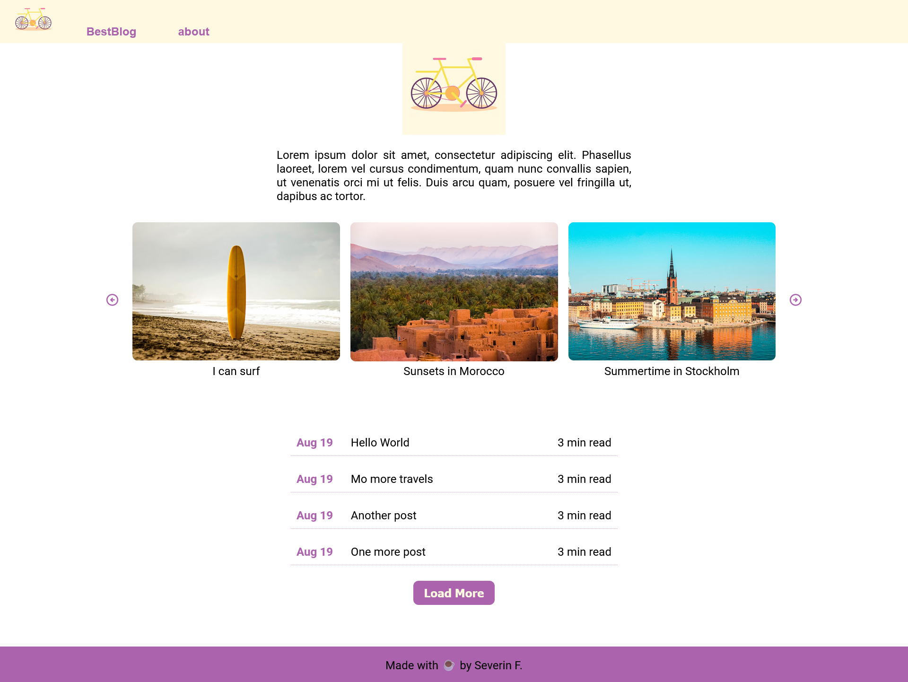

## Blog Post Manager 

In this exercise, build a simple blog post manager using **Vanilla TypeScript** and **Vite**. The goal is not to create a fully-fledged blogging platform, but to practice DOM manipulation, events, _( local storage - extra )_, and basic styling.

## Result
- Worked with tags instead of authors when filtering.
- Implemented a "change event" to save post in a temp array prior to clicking the save button. 
- The possibility to feature posts in the Featured Posts Carousel. 
- 

## 📌 Instructions

### ✅ Basics

- All blog posts should be displayed in a list on the page.

- There should be a form where users can add a new blog post with at least:

  - A **title**
  - A **body**
  - An **author**

- Each blog post should show:

  - The **title**
  - The **author**
  - The **content**
  - A **timestamp** (when it was created)

- Each blog post should have buttons to:

  - ✏️ **Edit** the post in place
  - 🗑️ **Delete** the post

- Style your application! Design matters in frontend development. But remember: it's usually best to finish the functionality or the styling first — don't do both at the same time.

---

### 🚀 More Complexity

- Allow **sorting** of blog posts by:

  - Timestamp (newest first – _default_)
  - Author (alphabetically)

- Blog posts should be **stored in local storage** and automatically loaded when the page is refreshed. Even if you close your browser and reopen it, the posts should still be there.

- Optionally, let users **filter posts** by author name.

- Use **textareas** for writing blog content to support multiline input.
